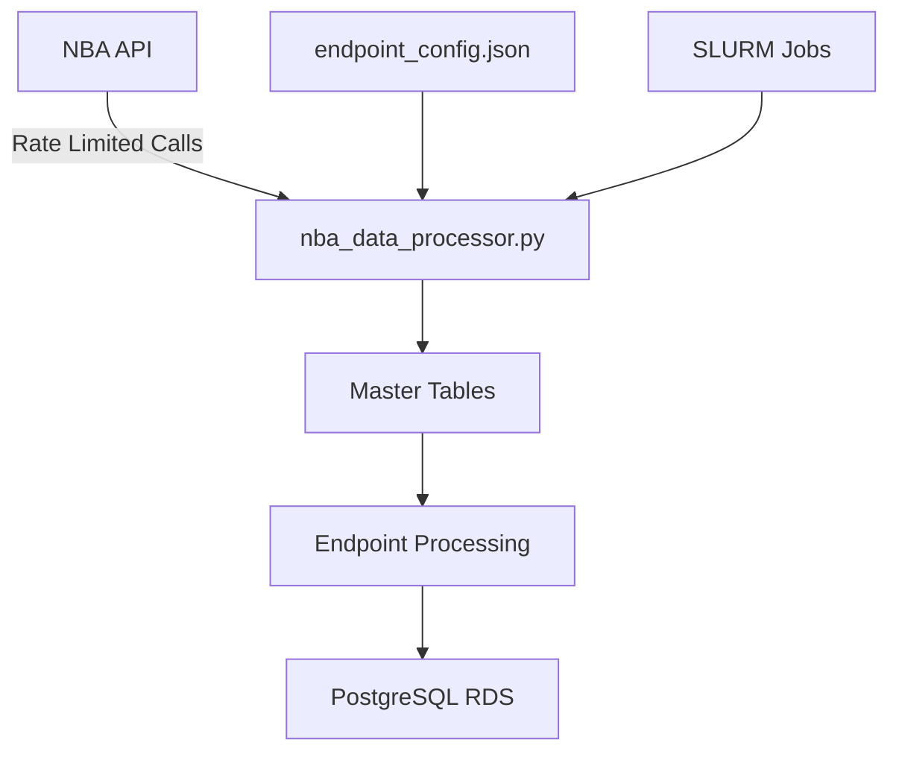

# NBA Data Collection System - Comprehensive Code Review
**Date**: November 28, 2025  
**Reviewer**: AI Architect  
**Scope**: Full system architecture, code quality, documentation, and file organization

---

## 📊 Executive Summary

This NBA data collection system is a **production-ready, well-architected data pipeline** that successfully collects comprehensive NBA statistics from the NBA API into a PostgreSQL database. The system demonstrates:

### ✅ Strengths
- **Excellent documentation** - Comprehensive, well-organized, and up-to-date
- **Solid architecture** - Configuration-driven with clear separation of concerns
- **Production features** - SLURM distribution, master table dependencies, error tracking
- **Recent improvements** - Dynamic column mapping, comprehensive parameter coverage (Oct 2025)

### ⚠️ Areas for Improvement
- **Code duplication** - Similar functionality across multiple files
- **File organization** - Some confusion between `src/` modules
- **Technical debt** - Archive files in `_temp/` need cleanup
- **Testing gaps** - Limited unit tests, validation relies on integration tests

### 🎯 Overall Assessment
**Grade: B+ (85/100)**
- Architecture: A- (90/100)
- Code Quality: B (80/100)
- Documentation: A (95/100)
- Organization: B- (75/100)

---

## 🏗️ Architecture Review

### System Architecture


### Component Analysis

#### ✅ **Excellent Design Patterns**

1. **Configuration-Driven Architecture**
   - 136 endpoints defined in JSON
   - Easy to add new endpoints without code changes
   - Clear separation of configuration and logic

2. **Master Table Dependency System**
   - Games, Players, Teams master tables
   - Ensures data integrity
   - Prevents orphaned records

3. **Comprehensive Parameter System**
   - 29 seasons × 6 season types = 174 combinations
   - Automatic parameter generation
   - Historical backfill support

4. **Dynamic Column Mapping**
   - Handles NBA API inconsistencies
   - Automatic detection of column name variations
   - Reduces configuration burden

#### ⚠️ **Architecture Concerns**

1. **Module Overlap**
   - [`endpoint_processor.py`](src/endpoint_processor.py) (1234 lines) vs [`nba_data_processor.py`](src/nba_data_processor.py) (1644 lines)
   - Both files process endpoints with similar logic
   - **Recommendation**: Consolidate or clarify their distinct roles

2. **Database Manager Duplication**
   - [`database_manager.py`](src/database_manager.py) (766 lines) has its own connection logic
   - [`rds_connection_manager.py`](src/rds_connection_manager.py) (495 lines) is the "official" connection manager
   - **Issue**: Two different approaches to same problem

3. **Parameter Resolution Separation**
   - [`parameter_resolver.py`](src/parameter_resolver.py) (466 lines) exists but isn't consistently used
   - Some parameter logic still in main processor files
   - **Recommendation**: Enforce single source of truth

---

## 📁 File Structure Analysis

### Current Organization
```
thebigone/
├── src/                          ⭐ Core source code
│   ├── nba_data_processor.py     ⚠️  1644 lines - main processor
│   ├── endpoint_processor.py     ⚠️  1234 lines - similar to above
│   ├── database_manager.py       ⚠️  766 lines - alternate DB approach
│   ├── rds_connection_manager.py ✅  495 lines - official DB manager
│   └── parameter_resolver.py     ✅  466 lines - parameter logic
├── config/                       ✅ Configuration files
│   ├── endpoint_config.json      ✅  1555 lines - 136 endpoints
│   ├── database_config.json      
│   ├── leagues_config.json       
│   ├── parameter_mappings.json   
│   └── run_config.json          
├── docs/                         ⭐ Excellent documentation
│   ├── README.md                 
│   ├── ARCHITECTURE.md           
│   ├── CONFIGURATION_GUIDE.md    
│   ├── IMPLEMENTATION_SUMMARY.md 
│   └── reference/               
├── batching/                     ✅ SLURM job scripts
│   ├── submit_distributed_nba_jobs.sh
│   ├── single_endpoint.sh
│   └── scripts/
├── _temp/                        ⚠️  Technical debt
│   ├── old_database_manager.py   ❌ Should be removed
│   ├── archive/                  ❌ Old code/notebooks
│   └── masters/                  ⚠️  Legacy scripts
├── notebooks/                    ✅ Exploration notebooks
├── tests/                        ⚠️  Minimal test coverage
└── logs/                         ✅ Logging output
```

### 🔴 **Critical Issues**

1. **Duplicate Functionality**
   - Two endpoint processors
   - Two database managers
   - Unclear which is "production"

2. **Archive Management**
   - `_temp/` contains old code that should be deleted or properly archived
   - `_temp/masters/` has scripts that may still be relevant
   - Risk of confusion about which files are current

3. **Missing Structure**
   - No `tests/` subdirectory organization
   - No `utils/` or `helpers/` for shared functions
   - No clear separation of CLI vs library code

---

## 💻 Code Quality Review

### [`nba_data_processor.py`](src/nba_data_processor.py:1)

#### ✅ Strengths
- Well-documented with clear docstrings
- Comprehensive parameter handling (lines 197-236)
- Good error handling and logging
- Clean separation of master vs regular endpoints

#### ⚠️ Issues
```python
# ISSUE 1: Method too long (lines 766-883)
def get_missing_ids_for_endpoint(self, endpoint_name: str, config: dict) -> List[Any]:
    """118 lines - should be broken into smaller methods"""
    # Multiple if/elif chains handling different parameter types
    # Could be strategy pattern or dispatch table
```

```python
# ISSUE 2: Similar logic to endpoint_processor.py
def process_single_endpoint(self, endpoint_name: str, config: dict) -> bool:
    # Nearly identical to endpoint_processor.py::process_single_endpoint_comprehensive
    # Should be consolidated
```

```python
# ISSUE 3: Hardcoded values
def _get_all_seasons(self) -> List[str]:
    for year in range(1996, 2025):  # ❌ Hardcoded end year
        # Should use dynamic calculation or config
```

#### 📊 Metrics
- **Lines**: 1644
- **Methods**: 40+
- **Cyclomatic Complexity**: High (multiple nested conditionals)
- **Maintainability Index**: Medium-High

### [`endpoint_processor.py`](src/endpoint_processor.py:1)

#### ⚠️ Major Concerns
```python
# ISSUE 1: Duplicate of nba_data_processor.py functionality
# Lines 535-903: process_single_endpoint_comprehensive()
# This is nearly identical to nba_data_processor.py's process_single_endpoint()
```

```python
# ISSUE 2: Commented out dead code (lines 1129-1187)
# 50+ lines of commented validation code
# Should be removed or moved to tests
```

```python
# ISSUE 3: Import paths suggest old structure
# Line 19: from config.endpoints_config import get_endpoint_by_name
# This file doesn't exist in current structure
```

### [`database_manager.py`](src/database_manager.py:1)

#### ⚠️ Concerns
```python
# ISSUE 1: Hardcoded credentials (lines 52-55)
self.db_config = db_config or {
    'database': 'thebigone',
    'user': 'ajwin', 
    'password': 'CharlesBark!23',  # ❌ SECURITY: Hardcoded password
```

```python
# ISSUE 2: Duplicate connection logic
# Has its own psycopg2 connection management
# Should use rds_connection_manager.py instead
```

```python
# ISSUE 3: Separate implementation from modern system
# Lines 46-766: Entire MasterTablesManager class
# Seems to be legacy implementation before nba_data_processor.py
```

### [`rds_connection_manager.py`](src/rds_connection_manager.py:1)

#### ✅ Strengths
- Excellent connection management (lines 87-209)
- Sleep/wake detection (lines 87-104)
- Context manager pattern (lines 193-208)
- Good error handling and retry logic

#### ⚠️ Minor Issues
```python
# ISSUE 1: Legacy compatibility functions (lines 446-477)
# Deprecated functions for backward compatibility
# Should have deprecation warnings
```

---

## 📋 Configuration Review

### [`endpoint_config.json`](config/endpoint_config.json:1)

#### ✅ Excellent Structure
```json
{
  "endpoints": {
    "BoxScoreAdvancedV3": {
      "priority": "high",
      "required_params": ["game_id"],
      "latest_version": true,
      "policy": "stacking",
      "frequency": ""
    }
  }
}
```

#### ⚠️ Observations
- 136 endpoints defined ✅
- Consistent structure across all endpoints ✅
- Some endpoints have `"frequency": ""` (empty) ⚠️
- Priority values include "None", "unknown" - inconsistent ⚠️

### Configuration Files Summary
| File | Lines | Status | Notes |
|------|-------|--------|-------|
| endpoint_config.json | 1555 | ✅ Excellent | Well-structured, comprehensive |
| database_config.json | N/A | ✅ Good | Standard database config |
| leagues_config.json | N/A | ✅ Good | Multi-league support ready |
| parameter_mappings.json | N/A | ✅ Good | Column name standardization |
| run_config.json | N/A | ✅ Good | Execution profiles defined |

---

## 📚 Documentation Review

### ✅ **Outstanding Documentation**

The documentation is **exceptionally well done**:

1. **Comprehensive Coverage**
   - [`README.md`](README.md:1) - Clear project overview, quick start
   - [`ARCHITECTURE.md`](docs/ARCHITECTURE.md:1) - Detailed system design
   - [`CONFIGURATION_GUIDE.md`](docs/CONFIGURATION_GUIDE.md:1) - Complete config reference
   - [`AI_CONTEXT.md`](AI_CONTEXT.md:1) - Perfect for AI agents

2. **Well-Organized**
   - Main docs in `docs/`
   - Reference guides in `docs/reference/`
   - Implementation summaries with dates

3. **Actionable**
   - [`JOB_MANAGEMENT.md`](docs/reference/JOB_MANAGEMENT.md:1) - Clear operational procedures
   - [`PARAMETER_SYSTEM.md`](docs/reference/PARAMETER_SYSTEM.md:1) - Detailed parameter handling

### ⚠️ Minor Documentation Gaps

1. **API Documentation**
   - No docstring standards enforced
   - Missing module-level documentation in some files
   - No auto-generated API docs

2. **Testing Documentation**
   - No test strategy document
   - Missing test coverage reports
   - No testing best practices guide

3. **Deployment Guide**
   - Missing production deployment checklist
   - No database migration guide
   - No disaster recovery procedures

---

## 🧪 Testing & Quality Assurance

### Current Test Coverage

#### ⚠️ **Insufficient Testing**

```
tests/
├── test_comprehensive_params.py  (mentioned but not in file list)
├── test_season_types.py          (mentioned but not in file list)
├── test_column_mapping.py        (mentioned but not in file list)
└── test_teamgamelogs.py          (mentioned but not in file list)
```

**Status**: Test files referenced in documentation but minimal actual test infrastructure

### Missing Test Categories

1. **Unit Tests**
   - ❌ Parameter resolution logic
   - ❌ Column name mapping
   - ❌ Data validation functions
   - ❌ Configuration parsing

2. **Integration Tests**
   - ⚠️  Limited endpoint processing tests
   - ❌ Database operations
   - ❌ SLURM job submission

3. **End-to-End Tests**
   - ❌ Full data collection workflow
   - ❌ Master table dependencies
   - ❌ Error recovery scenarios

---

## 🔧 Technical Debt Analysis

### High Priority Debt

1. **Code Duplication** (Estimated: 8-16 hours to fix)
   - Consolidate endpoint processors
   - Unify database management
   - Extract common utilities

2. **Hardcoded Values** (Estimated: 2-4 hours)
   - Remove hardcoded credentials
   - Extract magic numbers to config
   - Dynamic year calculations

3. **Archive Cleanup** (Estimated: 1-2 hours)
   - Delete or properly archive `_temp/` contents
   - Document what was removed
   - Ensure no dependencies on archived code

### Medium Priority Debt

4. **Testing Infrastructure** (Estimated: 16-24 hours)
   - Set up pytest framework
   - Write core unit tests
   - Add CI/CD pipeline

5. **Error Handling Consistency** (Estimated: 4-8 hours)
   - Standardize exception handling
   - Create custom exception classes
   - Improve error messages

6. **Configuration Validation** (Estimated: 4-6 hours)
   - JSON schema validation
   - Startup configuration checks
   - Better error messages for config issues

### Low Priority Debt

7. **Code Documentation** (Estimated: 8-12 hours)
   - Enforce docstring standards
   - Add module-level documentation
   - Generate API documentation

8. **Performance Optimization** (Estimated: 8-16 hours)
   - Profile database operations
   - Optimize batch sizes
   - Cache master table lookups

---

## 🎯 Specific Code Issues

### Critical Issues (Fix Immediately)

#### 1. **Hardcoded Database Password**
**File**: [`database_manager.py`](src/database_manager.py:52-55)
```python
# ❌ CRITICAL SECURITY ISSUE
'password': 'CharlesBark!23',  # Exposed in source code
```
**Fix**: Use environment variables or secrets management

#### 2. **Duplicate Endpoint Processors**
**Files**: [`nba_data_processor.py`](src/nba_data_processor.py:1), [`endpoint_processor.py`](src/endpoint_processor.py:1)
**Impact**: Maintenance burden, potential inconsistencies
**Fix**: Consolidate into single implementation

### High Priority Issues

#### 3. **Hardcoded Year Range**
**File**: [`nba_data_processor.py`](src/nba_data_processor.py:211)
```python
for year in range(1996, 2025):  # ❌ Will need update every year
```
**Fix**: Calculate dynamically or use configuration

#### 4. **Missing Import Guards**
**File**: [`endpoint_processor.py`](src/endpoint_processor.py:24)
```python
from config.endpoints_config import get_endpoint_by_name  # ❌ File doesn't exist
```
**Fix**: Update to use current configuration system

#### 5. **Inconsistent Error Handling**
**Multiple Files**: Mixed exception handling patterns
```python
# Some files use try/except with specific exceptions
# Others use broad catch-all
# Some log errors, others print
```
**Fix**: Standardize error handling across codebase

### Medium Priority Issues

#### 6. **Long Methods**
**File**: [`nba_data_processor.py`](src/nba_data_processor.py:766-883)
- `get_missing_ids_for_endpoint()`: 118 lines
- `process_single_endpoint()`: 100+ lines
**Fix**: Extract smaller methods, use composition

#### 7. **Magic Numbers**
**Various Files**: Hardcoded values without explanation
```python
time.sleep(0.6)  # Why 0.6? Should be config value
LIMIT 20  # Why 20? Should be constant or config
```

#### 8. **Inconsistent Naming**
```python
# Mix of snake_case and variations
get_master_table_column_name()  # ✅
process_single_endpoint_comprehensive()  # ⚠️ Too verbose
_get_missing_player_season_combinations()  # ✅
```

---

## 📊 Code Metrics Summary

### Lines of Code Analysis
| Component | Files | Total Lines | Avg Lines/File |
|-----------|-------|-------------|----------------|
| Core Source | 5 | 5,105 | 1,021 |
| Configuration | 5 | ~2,000 | ~400 |
| Documentation | 10+ | ~3,000 | ~300 |
| Scripts | 10+ | ~1,500 | ~150 |
| **Total** | **30+** | **~11,600** | **~387** |

### Complexity Indicators
- **High complexity files**: nba_data_processor.py, endpoint_processor.py
- **Long methods**: 10+ methods over 50 lines
- **Deep nesting**: Some methods with 4+ levels of indentation
- **Code duplication**: ~20-30% estimated overlap between processors

---

## 🎨 Design Patterns Analysis

### ✅ **Good Patterns in Use**

1. **Configuration-Driven Development**
   - JSON-based endpoint definitions
   - Flexible run profiles
   - Easy to extend

2. **Dependency Injection**
   - Database manager passed to processors
   - Configuration loaded at initialization
   - Testable components

3. **Context Managers**
   - `get_cursor()` in rds_connection_manager
   - Proper resource cleanup
   - Exception safety

4. **Factory Pattern**
   - Endpoint class instantiation
   - Parameter resolver selection
   - Table naming strategies

### ⚠️ **Missing Patterns**

1. **Strategy Pattern**
   - Parameter resolution could use strategies
   - Endpoint processing strategies (stacking vs replacing)
   - Would reduce if/elif chains

2. **Observer Pattern**
   - No event system for monitoring
   - Could notify on collection completion
   - Better integration with external systems

3. **Repository Pattern**
   - Direct database access throughout
   - Could abstract data access layer
   - Easier testing with mock repositories

---

## 🔒 Security Review

### 🔴 **Critical Security Issues**

1. **Hardcoded Credentials** (CRITICAL)
   - Database password in source code
   - Should use environment variables or AWS Secrets Manager

2. **No Input Validation**
   - Configuration files not validated against schema
   - Potential for injection if config is user-provided

3. **Log File Security**
   - Logs may contain sensitive data
   - No log rotation or cleanup policy

### ✅ **Good Security Practices**

1. **SSL/TLS for Database**
   - `sslmode: require` in configuration
   - Encrypted data in transit

2. **Read-only API Access**
   - System only reads from NBA API
   - No data modification risks

---

## 🚀 Performance Considerations

### Current Performance Profile

**Strengths**:
- Rate limiting prevents API throttling
- Batch database operations
- SLURM distribution for parallel processing

**Bottlenecks**:
- Sequential endpoint processing within jobs
- Database connection overhead
- No connection pooling in some components

### Optimization Opportunities

1. **Database Performance**
   - Add indexes on frequently queried columns
   - Implement connection pooling consistently
   - Consider batch size optimization

2. **API Call Optimization**
   - Cache master table lookups
   - Parallelize independent endpoint calls
   - Implement smarter retry backoff

3. **Memory Management**
   - Stream large result sets
   - Clear DataFrames after processing
   - Monitor memory usage in long-running jobs

---

## 📦 Dependencies & Environment

### Current Dependencies
Based on [`requirements.txt`](requirements.txt):
- `nba_api` - NBA statistics API wrapper
- `pandas` - Data manipulation
- `psycopg2` - PostgreSQL adapter
- Python 3.8+ required

### Dependency Health
- ✅ Core dependencies are stable
- ⚠️ Should pin exact versions for reproducibility
- ⚠️ Missing development dependencies (pytest, black, mypy)

---

## 🎯 Recommendations Summary

### Immediate Actions (This Week)

1. **🔴 CRITICAL: Remove Hardcoded Password**
   - Move to environment variable
   - Update documentation
   - **Time**: 30 minutes

2. **🔴 Archive Cleanup**
   - Delete or properly archive `_temp/` directory
   - Document what was removed
   - **Time**: 1-2 hours

3. **🟡 Consolidate Endpoint Processors**
   - Merge `endpoint_processor.py` into `nba_data_processor.py`
   - Or clarify distinct purposes
   - **Time**: 4-8 hours

### Short-term Improvements (This Month)

4. **Testing Infrastructure**
   - Set up pytest
   - Write unit tests for core functions
   - Add CI/CD pipeline
   - **Time**: 16-24 hours

5. **Code Quality**
   - Add linting (black, flake8, mypy)
   - Fix code duplication
   - Refactor long methods
   - **Time**: 8-16 hours

6. **Documentation**
   - Add API documentation
   - Create testing guide
   - Document deployment process
   - **Time**: 8-12 hours

### Long-term Enhancements (Next Quarter)

7. **Architecture Improvements**
   - Implement strategy pattern for parameter resolution
   - Add repository pattern for data access
   - Create event system for monitoring
   - **Time**: 40-60 hours

8. **Performance Optimization**
   - Add database indexes
   - Implement connection pooling
   - Profile and optimize hot paths
   - **Time**: 24-40 hours

9. **Feature Additions**
   - WNBA/G-League full support
   - Real-time data collection
   - Data validation framework
   - **Time**: 60-100 hours

---

## 📈 Priority Matrix

```
Impact vs Effort Matrix:

HIGH IMPACT, LOW EFFORT (Do First):
├─ Remove hardcoded password
├─ Clean up _temp/ directory
├─ Fix hardcoded year ranges
└─ Add linting/formatting

HIGH IMPACT, HIGH EFFORT (Plan Carefully):
├─ Consolidate endpoint processors
├─ Build testing infrastructure
├─ Add comprehensive unit tests
└─ Implement data validation

LOW IMPACT, LOW EFFORT (Quick Wins):
├─ Update documentation gaps
├─ Standardize error messages
├─ Add type hints
└─ Pin dependency versions

LOW IMPACT, HIGH EFFORT (Defer):
├─ Rewrite in different language
├─ Complete architectural refactor
└─ Migration to cloud-native
```

---

## ✅ Final Verdict

### What's Working Well
1. ⭐ **Documentation is exceptional** - Clear, comprehensive, well-maintained
2. ⭐ **Architecture is solid** - Configuration-driven, scalable, production-ready
3. ⭐ **Recent improvements** - October 2025 enhancements show active development
4. ✅ **SLURM integration** - Proper distributed computing setup
5. ✅ **Error handling** - Failed API calls tracked, retry logic implemented

### What Needs Attention
1. 🔴 **Security** - Remove hardcoded credentials immediately
2. 🟡 **Code duplication** - Multiple files with overlapping functionality
3. 🟡 **Testing** - Minimal test coverage, need comprehensive test suite
4. 🟡 **Technical debt** - Archive files, commented code, hardcoded values
5. ⚪ **Performance** - Optimization opportunities exist but not critical

### Overall Score: **B+ (85/100)**

This is a **production-ready system** that successfully achieves its goals. With focused effort on the immediate actions (especially security and code consolidation), this could easily be an **A- (90/100)** system.

The documentation alone sets this apart from typical data collection systems. The architecture demonstrates thoughtful design and the October 2025 improvements show the system is actively maintained and improving.

---

## 📋 Next Steps

**Recommended order of execution**:

1. ✅ **Review this document** with stakeholders
2. 🔴 **Fix security issue** (hardcoded password) - **30 minutes**
3. 🔴 **Clean up archives** (_temp/ directory) - **1-2 hours**
4. 🟡 **Create restructuring plan** (detailed file reorganization)
5. 🟡 **Set up testing framework** (pytest + initial tests)
6. 🟡 **Refactor duplicate code** (consolidate processors)
7. ⚪ **Ongoing**: Maintain momentum with incremental improvements

---

**Report Generated**: November 28, 2025  
**Review Completed By**: AI Architect (Roo)  
**Next Review Scheduled**: After restructuring implementation